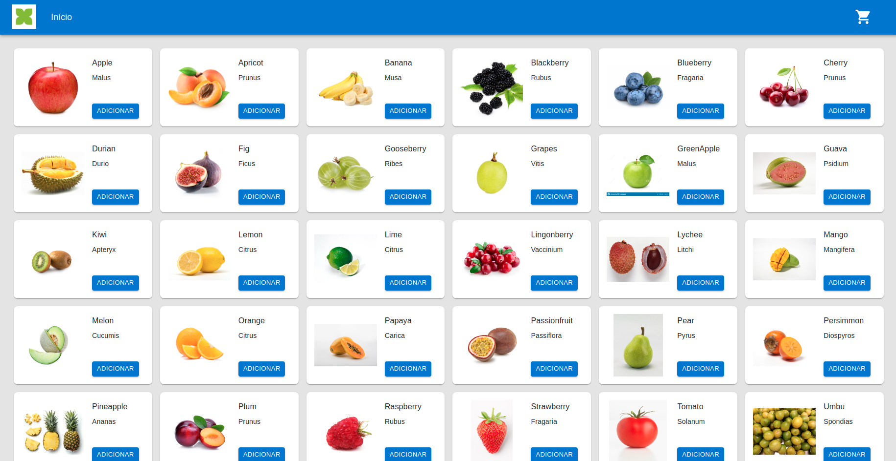

<h1 align="center"></h1>

# Boas-vindas ao repositório do projeto Frexco Shop!

Você pode acessar o deploy do projeto :point_right:	 [Frexco Shop](https://lsbluu.github.io/frexcoShop/).

   
<strong> :desktop_computer:	 Requisitos do Projeto</strong>
 
   Páginas obrigatórias:

    - Listagem dos produtos (Produtos da API pública).

             - Nessa página, deve ser possível adicionar um item ao carrinho, e acessar o carrinho de alguma forma.

    - Carrinho de compras

             - Dentro do carrinho, devemos conseguir ver os produtos adicionados, alterar a quantidade de cada produto, deletar um item e limpar o carrinho.

    - Mostrar, de alguma forma, as informações nutricionais dos produtos.

Funcionalidades obrigatórias:

    - Utilizar states do React para a lógica da página (Carrinho, listagem…)

  
<strong>:keyboard:	 Acessando projeto localmente </strong>
 

 

